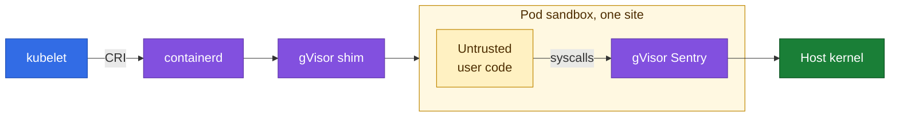

### Hi, I'm Nahum

Infra engineer at [Wix](https://www.wix.com), Dublin. I keep a multi-region Kubernetes platform for untrusted user code running: isolation, cold starts, scaling, cost and on-call, one site per gVisor sandbox.

When the bug is in open source, I fix it upstream.

### Upstream

| [containerd](https://github.com/containerd/containerd) | |
|---|---|
| [Bound snapshot GC so a hung snapshotter can't block new pods while the node still reports Ready](https://github.com/containerd/containerd/pull/13799) | merged, then reverted for a client-side fix |
| [Configurable deadline on proxy snapshotter calls so one hung call can't block the whole snapshotter](https://github.com/containerd/containerd/pull/14187) | open |

| [gVisor](https://github.com/google/gvisor) | |
|---|---|
| [30s deadlines on runsc Kill, Stats and Status so a wedged sandbox can't hold the shim lock forever](https://github.com/google/gvisor/pull/14549) | merged |
| [Recover missed systrap interrupts and kill only the stuck subprocess, so a wedged task can't block sandbox teardown](https://github.com/google/gvisor/pull/14201) | merged |
| [Document inotify behaviour on shared volumes](https://github.com/google/gvisor/pull/11563) | merged |

[LinkedIn](https://www.linkedin.com/in/lnahum)
